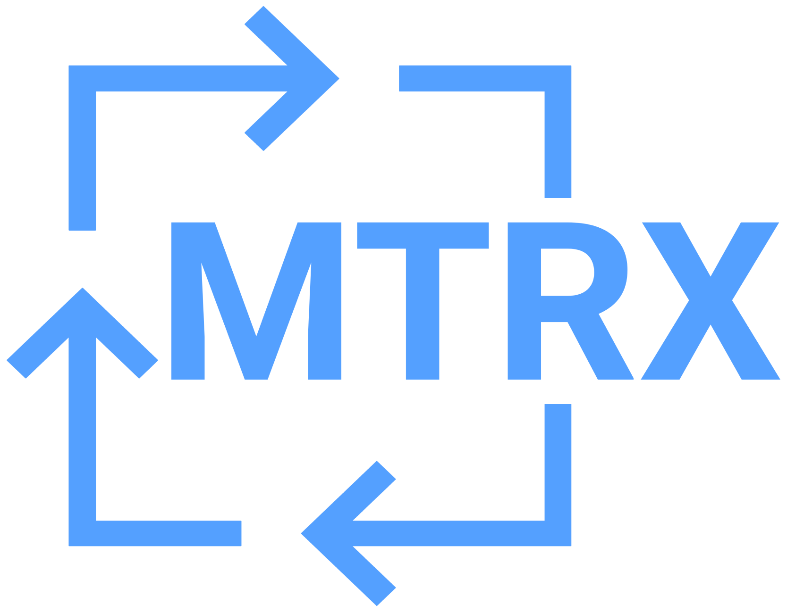

# Matrix

Matrix is a service that redirects to a new interesting url from a list of unique urls whenever the service is visited.

It is deployed at -- https://code.devtools.tech/matrix

## Why?

There is no reason. It was started as a quick fun project to help folks discover new interesting things and let it surpise them. When they visit the url, they don't know where they will end up (website) but it is sure that it would be someplace where they can either learn or enjoy. Also, for content creators, it is a good way to get some good quality traffic to their amazing creations.

P.S. Whereever you end up, do let the creator know that you came from Matrix service by Devtools Tech and do appreciate their work. :)

## How to contribute and what type of links are allowed?

This is open-sourced. You can raise a PR by adding new links to `links.json`. There is a limit to type of links that can be added, a link could be from one or more of the following --

- Open source projects
- Project showcase/demo
- Interesting reads
- YouTube videos/channels
- Games
- Music list
- Learning resources, courses, and likes

Things not allowed --

- NSFW content
- Anything that promotes hate, discrimination, and distasteful content
- Personal social profiles
- Malicious content

Both lists are Work In Progress and would evolve over time.
